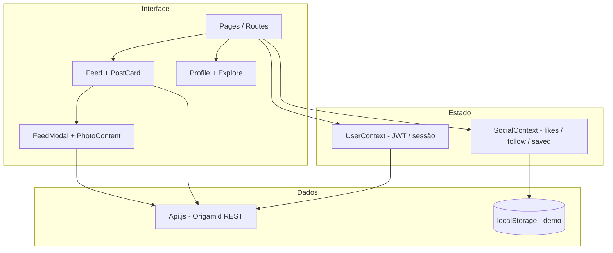

# PetGram

[](https://react.dev/)
[](https://vitejs.dev/)
[](https://reactrouter.com/)
[](LICENSE)

**PetGram** é uma rede social de pets inspirada no Instagram, desenvolvida como projeto de portfólio em React. O app consome a [API Dogs (Origamid)](https://dogsapi.origamid.dev/json) para autenticação, fotos e comentários reais, e complementa a experiência com interações sociais em modo demonstração via `localStorage`.

<p align="center">
  
</p>

<p align="center">
  <a href="https://leandrozanardo.github.io/dogs/"><strong>Ver demo ao vivo</strong></a>
  &nbsp;·&nbsp;
  <a href="#como-executar">Executar localmente</a>
  &nbsp;·&nbsp;
  <a href="#conta-de-demonstração">Conta demo</a>
</p>

---

## Destaques

- UI **mobile-first** com navegação inferior e **sidebar no desktop**, próxima ao Instagram web
- Feed vertical com abas **Para você** / **Seguindo**, scroll infinito e modal de post
- **Explorar** em grade com overlay de engajamento
- **Stories**, curtidas, salvar e seguir (camada demo local)
- Autenticação **JWT**, cadastro, recuperação de senha, postagem com imagem, comentários e exclusão via API
- Perfil com header, estatísticas, grid de publicações e aba **Salvos**
- Tratamento de erros de rede e feedback visual em comentários

---

## Funcionalidades

| Área | Descrição | Origem dos dados |
|------|-----------|------------------|
| Feed | Posts em cards, duplo toque para curtir, abrir modal | API |
| Seguindo | Filtra autores que você seguiu | `localStorage` + API |
| Explorar | Grade 3×N de fotos | API |
| Stories | Carrossel por autor, anel “visto” | Demo (`localStorage`) |
| Curtidas / Salvos | Toggle e contadores na UI | Demo (`localStorage`) |
| Comentários | Input fixo no modal + botão Publicar | API |
| Perfil | Grid, seguir, insights (stats) | API + demo |
| Auth | Login, registro, reset de senha | API |

---

## Stack

| Tecnologia | Uso |
|------------|-----|
| **React 18** | UI componentizada, hooks, Context API |
| **Vite 6** | Build e dev server |
| **React Router 6** | Rotas públicas, aninhadas e protegidas (`Outlet`) |
| **CSS Modules** | Estilos por componente + tokens globais |
| **Victory** | Gráficos na página de estatísticas |
| **Fetch API** | Integração REST com JWT |

---

## Arquitetura



### Estrutura do projeto

```
src/
├── Api.js                 # Endpoints REST (token, fotos, comentários…)
├── UserContext.js         # Sessão JWT e auto-login
├── context/
│   └── SocialContext.js   # Curtidas, seguir, salvos, stories, atividade
├── Hooks/
│   ├── useFetch.js
│   ├── useForm.js
│   ├── useCommentPost.js  # POST de comentário isolado
│   └── useLocalStorage.js
├── Components/
│   ├── Feed/              # PostCard, Feed, modal
│   ├── Navigation/        # Header, bottom nav, sidebar desktop
│   ├── Photo/             # Modal de post, comentários
│   ├── Profile/           # Header de perfil, abas, salvos
│   ├── Stories/           # Barra e viewer
│   └── Login/ User/ …
├── App.jsx
└── main.jsx
```

---

## Como executar

**Requisitos:** Node.js 18+

```bash
git clone https://github.com/leandrozanardo/dogs.git
cd dogs
npm install
npm run dev
```

Acesse o endereço exibido no terminal (em geral `http://localhost:5173`).

### Build de produção

```bash
npm run build
npm run preview
```

### Build igual ao GitHub Pages

```bash
npm run build:gh-pages
npm run preview:gh-pages
```

---

## Conta de demonstração

A API Origamid é compartilhada e pode ser resetada. Para testar rapidamente:

| Campo | Valor |
|-------|--------|
| Usuário | `dog` |
| Senha | `dog` |

Você também pode **criar uma conta** em `/login/criar`.

---

## Deploy (GitHub Pages)

O workflow [`.github/workflows/deploy.yml`](.github/workflows/deploy.yml) publica automaticamente em cada push na branch `master` / `main`.

1. Em **Settings → Pages**, selecione a fonte **GitHub Actions**
2. Após o workflow, o site ficará em: **https://leandrozanardo.github.io/dogs/**

O `base` do Vite usa `VITE_BASE_PATH=/dogs/` no CI; localmente o `base` permanece `/`.

---

## Decisões técnicas

- **API real + demo local:** likes, follow e stories não existem na API do curso; foram implementados em `localStorage` para simular engajamento sem backend próprio — documentado na UI e neste README.
- **Comentários:** hook dedicado `useCommentPost` com parsing robusto da resposta WordPress e formulário fixo no rodapé do modal (evita campo cortado no mobile).
- **Rotas protegidas:** padrão React Router v6 com `Outlet` e spinner durante validação do token.
- **Migração CRA → Vite:** build mais rápido, suporte a Node atual e code-splitting do Victory nas estatísticas.

---

## Limitações conhecidas

- API focada em **cães** (campos peso/idade); branding do app é **pets** de forma geral
- Dados de curtidas/seguir **não sincronizam** entre dispositivos
- API externa pode ficar **offline** ou resetar contas
- Sem DMs, notificações push nem backend próprio

---

## Evolução do projeto

Este repositório partiu do projeto **Dogs** (curso Origamid, Create React App + React 16). A evolução para portfólio incluiu:

- Migração para **Vite + React 18**
- Redesign completo estilo **Instagram**
- Correção de rotas protegidas e fluxo de comentários
- Camada social demo e deploy automatizado

---

## Licença

[MIT](LICENSE) — © Leandro Zanardo

---

## Autor

**Leandro Zanardo**

- GitHub: [@leandrozanardo](https://github.com/leandrozanardo)
- Repositório: [github.com/leandrozanardo/dogs](https://github.com/leandrozanardo/dogs)

Se este projeto te ajudou ou quiser sugerir melhorias, sinta-se à vontade para abrir uma issue ou entrar em contato.
